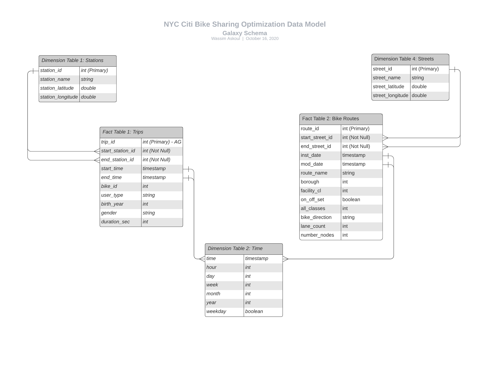

# NYC Citi Bike Sharing Optimization Application

## Data Engineering Project
## By Wassim Askoul

### Project Summary

Bike and scooter sharing services have taken the world by storm in the past few years. It is a service that has companies, governments, and people interested in moving our cities and communities into a more sustainable enviroments. The aim of many stakeholders is to encourage everyone to get to their destinations utilizing bikes and electric scooters. This nobel innovation is a service to our earth to fight global warming, to our society to be more enviromentally conscious, and to our communities to be more sustainable. Unfortunately, bike and scooter sharing have faced dangerous problems with cities, like New York City, not ready to provide safe routes or zoned parking. Other problems occur on accessibility and optimization of providers of this service like Uber, Lyft, and Citi Bikes. I believe that a unified source of bike data from providers, government, and users is an important step to allow us to start solving these problems. This project will serve as a first step to create mentioned data source.

### Scope the Project and Data Gathering

The project orchestrate collection of data from major sources in the bike sharing space. The goal is to pull relevant information to centralize potentially relevant information to solve current and future problems that arise from providing this service to customers. Data would be structured in a clean but most raw version in order to keep a wide scoop for usage by data analysts, business analysts, data scientist, government officials, city planners, and many more. The main goal is to unify the dispersed data from major providers like Lyft, Uber, Citi Bikes, and city-based data on traffic, bike routes, and other data from the NYC Open Data project.

The scope of the project will be limited to NYC for location with a potential to implement in other cities after its success here. The time scope of the project will be looking at data starting from June 2013 and going up to August 2020 with data pipelines set to run on a monthly, quarterly and annually timeframe depending on the data sources.

The data sources are as follows:

1. **City Bike:** The data from the NYCBS project, the data is provided in an [Amazon S3 buckets](https://s3.amazonaws.com/tripdata/index.html). It is split into seperate zip files for every month from 2013 to August 2020 -for the purposes of this project we will focus on data starting January 2018 - with an added zip file to the same bucket every month.

2. **NYC OpenData:** The data from NYC's OpenData project would be rertrieved through an API endpoints for data for the city's [Bicycle Routes](https://data.cityofnewyork.us/Transportation/Bicycle-Routes/7vsa-caz7).

The tools that will be used in this project are Apache Cassandra, Apache Spark, Amazon's S3 and RedShift, and Apache Airflow. Given that we will be working with large amounts of data from multiple sources, we will work with Cassandra and optimize our reads with queries needed to setup the data of interest in mind. Fast writes will be essential to have our data available for later use by different types of users. Apache Spark is the tool that will be oriented towards handling potential data streams from a real-time data source like Google's Map Platform. Although for the purposes of this project, we will be running the data lake with Spark on local mode, the feature of upgrading our system to a manager mode for potential future use by personnel from poviders, goverment, and any professional who is curious about this unified source of data on bike sharing in NYC. AWS's S3 is a tool that is needed to work with when extracting data from sources like Lyft and Citi Bike. In addition, RedShift is the tool that will be utilized as the home of our data as a data warehouse. Finally, Airflow is our data management tool using DAGs that will organize the schedules of data pulls for a continued and updated versions of our unified data sources.

### Explore And Assess The Data

In order to explore and wrangle the data, a jupyter notebook is created to tackle this part that is called: Data_Wrangling.ipynb. A step-by-step is provided as a guide through that process there.

### Define The Data Model

Our data is comprised of two main independent facts that are trips made by the Citi bikes' customers and the bike routes established by the NYC local government. With this in mind, the data model is established as a galaxy schema with two fact tables namely, Trips table and Bike Routes table. The dimension tables for the Trips table are Trip's time, Stations, and a created dimension of whether a trip goes through the bike routes called Trips Through Routes. Moreover, the dimension tables for the Bike Routes table are Route Details table, Streets table and the same Trips Through Routes of the Trips fact table. These two star schemas connected through one dimension table make up our galaxy schema.

The reason why the schema wasn't setup as a snowflake schema with the Bike Route table as a dimension table with extension from the Trips fact table joined by the station_id and the street_id is because of lack of connection between the two data sources meaning Citi Bike's stations are not located accordingly to the Bike Routes setup by the city. This could be one function of this data model to coordinate a better stations and routes for cyclist in the city. In addition, this model keeps our data model flexible for a potential adding of a new data source from a new provider. For example, if uber start their own program here in NYC for bikes and scooter, or if a provider like Revel would like to join their data to this model, it would be as easy as creating a new fact table of trips of that provider coonected through the Trips Through Routes dimension table. Even better idea is to follow the structure of the Citi Bikes database and then it would just adding the trips of the new provider to the Trips fact table with adding a new metric of provider - in order to keep track of each trip's provider.

#### Data Dictionary:

station_id: id of station from the citi bike sharing provider, it reference the start station and end station of every trip
station_name: the name of the station
station_latitude: the latitude of the station
station_longitude: the logitude of the station
street_id: id of street from the nyc local goverment, it reference the start street and end street of every trip, and it autogenerated
street_name: the name of the street
street_latitude: the latitude of the street
street_longitude: the logitude of the street
time: it is the timestamp of multiple sources in our data model, like the start and end time of a trip or the initilization date or modification data of a bike route
trip_id: it is an autogenerated id that represents every single trip from the citi bike sharing provider
start_station_id: references the id of the first station
end_station_id: references the id of the last station
start_time: the timestamp of the beginning of the trip
end_time: the timestamp of the end of the trip
bike_id: an id given by citi bike to identify a specific bike
user_type: two option string value (Customer = 24-hour pass or 3-day pass user; Subscriber = Annual Member)
birth_year: the birth year of the person in this specific trip
gender: 0 for Non-binary; 1 for male; 2 for female
duration_sec: integer representing the number of seconds the trip took
route_id: it is an id given by NYC to identify routes with bike lanes
start_street_id: references the first street the route starts from
end_street_id: references the last street the route reaches to
inst_date: timestamp of the initialization date of the bike route
mod_date: timestamp of the last modification date of the bike route
route_name: the name of the bike route
borough: integer representing the borough in NYC (1= Manattan, 2= Brooklyn, 3= Queens, 4= Staten Island, 5= Bronx)
facility_cl: a clasification of the level of the route (I, II, III)
on_off_set: a boolean with On or Off
all_classes: all classes throughout the bike route
bike_direction: the direction where bikes can use this route (R= right lane, L= left lane, B= Both lanes)
lane_count: the number of lanes on the route
number_nodes: the number of turns and diverges throughout the route
Run ETL to Model The Data
Apache Airflow is the main tool to achieve the data modeling proposed since a data pipeline needs to be run on a monthly basis with new data coming in. The folder data_pipeline contains the different elements that comprise the data pipeline with a folder for dags, one for operators and helper function, and another for creating the tables according to the model defined above.

#### Elements of The Project

The following python scripts were used to develop this pipeline:

1. de_dag.py: Defines the dag and assigns operators to each respective task in the Airflow pipeline. Additionally, it dictates the sequence of tasks at the bottom of the file.

2. sql_queries.py: Defines SQL queries to read and load staging, fact, and dim tables. Found in plugins/helpers directory

3. stage_redshift.py: Defines StageToRedshiftOperator that reads from S3 and writes to staging tables in AWS Redshfit

4. load_fact.py: Defines LoadFactOperator that extracts data from staging into songplays (or otherwise defined) fact table

5. load_dimension.py: Defines LoadDimensionOperator that extracts data from staging into the song, user, artist, and time dim tables

6. data_quality.py: Defines DataQualityOperator that counts the rows in each table to ensure data has been written to RedShift

### Complete Project Write-up - with some scenarios

This part is to address different scenarios that might come in the way of scalability.

1. The data was increased by 100x: In this case and based on the type of data that we have and the process it takes to funnel it into our final cluster on Redshift, a 100x increase in the size of the initial zip files might run us into a compiling problem. The unzipping process in this project has been initialized and set to unzip the csv data locally, and then load that into Redshift. The best solution here if cost was not an issue is to utilize a tool like AWS CloudFront or AWS Lamda with both having different approaches to avoid unzipping data locally.

2. The pipelines would be run on a daily basis by 7 am every day: This would not be an actual issue since our data is generated or ammended on a monthly basis; however, for an argument's sake if we add new data source that requires to be run daily let's say a new provider would like to join their data with this model, then we could easily create a new DAG that would handle this task seperately.

3. The database needed to be accessed by 100+ people: This is not a problem since our database is hosted on AWS and no matter how many clients requires access to a single database, Redshift would take care of that scalability issue.